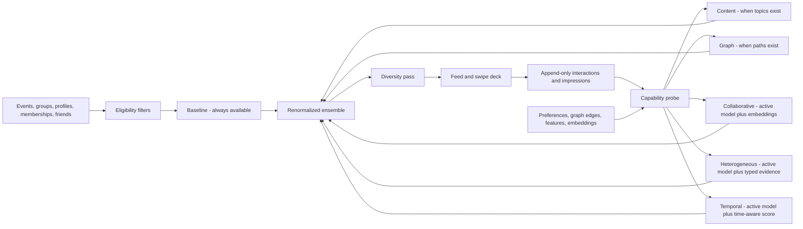

# MatchBook Progressive Recommendation Architecture

Future-complete data foundation, progressive model activation, and low-cost operating plan  
Prepared and implemented in the MatchBook Meteor/MongoDB application - August 2026

## Executive decision

Build the complete recommendation data spine now, but do not pretend every advanced model is ready now.

MatchBook now follows one simple rule:

> Missing data makes a scoring component abstain. It never makes the recommendation request fail.

The system always has a baseline. As a particular user, event, or group gains enough trustworthy information, additional components activate for that item and user. The final score is reweighted across only the components that actually have evidence.

This gives MatchBook both things it needs:

- A practical recommendation system that works for a brand-new user and today's sparse event records.
- Database structures for collaborative filtering, heterogeneous graphs, temporal models, training runs, experiments, and evaluation when the evidence eventually supports them.

No vector database, graph database, paid recommendation API, streaming platform, or separate model-serving service is required for the current scale. The implemented foundation runs in the existing Meteor server and MongoDB deployment.

## 1. The corrected architecture in one view



The database is future-complete. The runtime remains intentionally modest.

## 2. What is implemented now

### Data and schema

- Optional advanced fields on events for canonical topics, organizer, venue, series, timezone, GeoJSON location, attendance mode, publication state, cancellation state, visibility, capacity, availability, age, and accessibility.
- Sixteen recommendation collections covering behavior, state, requests, impressions, preferences, graph data, model artifacts, datasets, experiments, job runs, RSVP, and attendance.
- Compound indexes for idempotency, recent user history, entity history, requests, impressions, graph traversal, feature versions, embedding versions, experiments, and job processing.
- An idempotent startup scaffold that projects existing MatchBook records into canonical topics, venues, organizers, series, and typed graph edges.
- Draft registry entries for LightGCN, heterogeneous graph, and temporal graph challengers. Draft means structurally prepared, not trained or production-ready.

### Runtime recommendation system

- One authenticated `recommendations.get` server method for events and groups.
- A null-safe adaptive ensemble with baseline, content, graph, collaborative, heterogeneous, and temporal component slots.
- Per-item capability checks rather than a global user tier.
- Weight renormalization across available components.
- Hard safety and eligibility filters before scoring.
- Topic and host diversification after scoring.
- A deterministic baseline fallback if adaptive ranking or request logging fails.
- Account-derived owner fields and internal component diagnostics removed from client responses.

### Behavior capture

- Append-only history for impressions, opens/flips, passes, RSVP changes, attendance, group joins/leaves, follows, calendar adds, undo, and corrections. A right swipe on an event is Going and is recorded as `rsvp_going`; taking it back is `rsvp_canceled`. `interested`, `saved` and `unsaved` remain readable as history and are refused as new writes.
- A browser may record only `impression`, `opened`, `flipped` and `calendar_added`. Everything else is recorded by the server method that makes it true.
- Idempotent client event keys, so network retries do not create duplicate actions.
- Separate materialized current state for fast product reads.
- Compatibility capture behind the existing swipe and group membership methods.
- Recommendation telemetry is best-effort: a telemetry failure cannot break a user's RSVP, pass, join, leave, or undo.
- Model, tier, and component provenance is trusted only when the recommendation request belongs to the signed-in user.

### Product surfaces

- The masonry discovery feed and swipe deck both consume the same server ranking service.
- If the service is unavailable, the feed keeps its existing client score and the deck keeps its date/name order.
- The swipe deck logs only its active top card as an impression.
- The masonry feed logs an impression only after at least 50% of a card is visible for one second.
- Opens/flips and later actions retain their request and ranking position when available.

## 3. The null contract

Null-safety is a product rule, not just defensive coding.

### Rules

1. Optional source values may be absent or null at the ranking boundary.
2. In persisted optional preference fields, `null` means clear the value; the stored field is removed.
3. Unknown is not silently converted to a negative. Unknown price is not expensive. Unknown location is not far away. Missing topics do not mean a topic mismatch.
4. A component with missing required inputs returns `available: false` and contributes neither score nor weight.
5. The baseline component is always available for an otherwise eligible item.
6. Invalid or missing advanced artifacts cannot produce `NaN`, an exception, or an empty result by themselves.
7. Unknown historical timestamps remain missing. The backfill does not invent an epoch or pretend the action happened on migration day.
8. Hard eligibility remains hard. An event with no usable date cannot be safely recommended as an upcoming event; a canceled, private, sold-out, or already-past event stays out.

### Weight renormalization

For the available component set `A`:

```text
finalScore = sum(weight[c] * score[c] for c in A)
             / sum(weight[c] for c in A)
```

If every configured weight is accidentally zero, the system uses the baseline score directly.

Example:

| User/item state | Available components | Effective behavior |
|---|---|---|
| Empty profile, sparse event | Baseline | Useful, varied upcoming order |
| Topics selected | Baseline + content | Topic matching joins the score |
| Joined host group | Baseline + content + graph | Host/group affinity joins the score |
| Active collaborative model, user and item embeddings | Prior components + collaborative | Similar-behavior evidence joins the score |
| Only the user embedding exists | Prior components only | Collaborative abstains; no penalty |
| Temporal model active but item score absent | Prior components only | Temporal abstains for that item |

This is better than assigning a user one permanent tier. One user may receive a collaborative score for Event A, content-only scoring for Event B, and baseline scoring for a newly imported Event C in the same request.

## 4. Capability gates by component

| Component | Minimum usable evidence | Activation gate | Why it may abstain |
|---|---|---|---|
| Baseline | Eligible item ID and usable event date for events | Always | Only hard ineligibility removes the item |
| Content | At least one user preference token and one candidate token with overlap, or usable contextual filters | Per user/item | Empty profile, missing categories, or no overlap |
| Graph/hybrid | Joined host group or a usable positive user-to-item edge | Per user/item | No path, excluded edge, or missing host link |
| Collaborative | Active collaborative model plus current user and item embeddings from the same version | Per user/item/version | Draft model, one-sided embedding, expired artifact, or dimension mismatch |
| Heterogeneous | Active heterogeneous model plus compatible typed embeddings | Per user/item/version | Typed graph may exist while the trained artifact does not |
| Temporal | Active temporal model plus a current precomputed model score for the item | Per item/version | Missing time evidence, missing snapshot, or model not promoted |

Model registry status is an operational lock:

```text
draft -> training -> shadow -> canary -> active -> retired
                                  |          |
                                  +-> rolled_back
```

Only `active` artifacts are eligible for live scoring. Having a table, graph, or embedding is not enough.

## 5. The future-complete MongoDB data spine

Source collections remain authoritative. Recommendation collections preserve history, projections, artifacts, and measurement.

| Collection | Role now | Advanced use later |
|---|---|---|
| `RecommendationInteractions` | Immutable user action ledger | Training examples, sequence modeling, replay, corrections |
| `RecommendationUserItemStates` | Fast current state and signal counts | Serving exclusions and compact user/item features |
| `RecommendationRequests` | Model/tier/capability/latency record per ranking call | Offline evaluation, fallback monitoring, experiments |
| `RecommendationImpressions` | What was genuinely shown, where, and at what size | Exposure-aware training and unbiased evaluation |
| `RecommendationPreferences` | Nullable explicit topics, time, radius, price, atmosphere, access, and privacy | Cold start and preference-strength models |
| `RecommendationEntities` | Canonical topic, venue, organizer, and series nodes | Stable heterogeneous graph node identity |
| `RecommendationGraphEdges` | Typed, timestamped, privacy-qualified relationships | Graph features, LightGCN inputs, heterogeneous/temporal graphs |
| `RecommendationFeatureSnapshots` | Versioned structured, text, temporal, and model-score snapshots | Reproducible features and precomputed inference |
| `RecommendationEmbeddings` | Versioned user/item/entity vectors with validity windows | Collaborative and graph challengers |
| `RecommendationModelVersions` | Lifecycle, configuration, evaluation, artifact, and rollback metadata | Promotion and rollback control |
| `RecommendationDatasetVersions` | Training cutoff, counts, checksum, URI, and status | Reproducible datasets and leakage prevention |
| `RecommendationExperiments` | Experiment status, variants, allocation, and dates | Controlled online comparison |
| `RecommendationAssignments` | Stable user-to-variant assignment | Prevents users moving between variants |
| `RecommendationJobs` | Idempotent job type, status, attempts, lease/heartbeat, cursor, counts, error | Reliable backfill, feature, dataset, training, and evaluation jobs |
| `EventRSVPs` | Current going/maybe/canceled state | Strong intent labels and event capacity features |
| `EventAttendances` | Self-reported or verified attendance state | Strong outcome labels and attendance prediction |

### Important storage choices

- Interactions are canonical and append-only.
- Current state is derived and replaceable.
- Impressions are not duplicated as graph edges. Future graph datasets can derive view edges from the interaction ledger, reducing live storage growth.
- Structural edges may lack timestamps when the source never recorded one.
- Behavioral edges carry the action timestamp when known.
- Every model artifact and embedding is versioned; incompatible versions never mix silently.
- Graph edges carry `private`, `aggregate`, `public`, or `excluded` eligibility so later pipelines have an explicit privacy gate.

## 6. Canonical graph structure

Node types exist now for:

```text
user, event, group, organizer, venue, topic, series
```

Relationship types exist now for:

```text
accepted_friend
joined_group, followed_group
hosts, has_topic, occurs_at, belongs_to_series
viewed, opened, interested, passed, saved
rsvp_going, attended
```

This lives in ordinary MongoDB. At MatchBook's current scale, a dedicated graph database would add operational cost without making the recommendation request meaningfully better. Offline model jobs can export typed nodes and edges when graph training is justified.

## 7. How each recommendation level develops

### Level 0 - Baseline, active now

Purpose: never leave a new user with a broken or random experience.

Inputs:

- Event timing and eligibility.
- Listing completeness.
- Creation freshness when known.
- Stable per-record tie-breaking.

This is cheap, deterministic, and usable with almost no personal data.

### Level 1 - Content, active opportunistically now

Purpose: use what the user explicitly says they like and what the item actually describes.

Inputs:

- Profile interests.
- Recommendation preference topics and atmospheres.
- Event/group topics, categories, tags, title, and description.
- Recent positive actions whose context carries topics.
- Region, price, and preferred day when available.

If either side lacks evidence, content abstains for that item.

### Level 2 - Graph/hybrid, active opportunistically now

Purpose: use direct product relationships without training a neural model.

Current examples:

- An event is hosted by a group the user joined.
- A user has a positive event/group edge from a prior action.

The source projection already creates group/event, event/topic, event/venue, organizer/event, series/event, and accepted-friend edges. Social recommendations should remain privacy-gated and should not be explained with another person's private action.

### Level 3 - Collaborative challenger, structure ready

Purpose: learn from repeated user-item behavior overlap.

The first practical challenger does not need to be LightGCN. Start with a nightly item-to-item co-occurrence table or conventional matrix factorization. Use LightGCN as a benchmark when repeated-user overlap is strong enough to evaluate it.

Activation requires:

- Trustworthy impressions and positive/negative actions.
- A leakage-safe dataset version and cutoff.
- A promoted model record.
- User and item embeddings from exactly that model version.
- Offline improvement plus acceptable cold-start, coverage, diversity, and latency.

The system already knows how to use the embeddings once those conditions are met.

### Level 4 - Heterogeneous graph challenger, structure ready

Purpose: combine users, events, groups, organizers, venues, topics, and series in one learned representation.

This is a research/learning project, not a required production expense. The typed nodes, typed edges, feature snapshots, dataset registry, model registry, and artifact slots already exist. A model stays `draft`, `training`, or `shadow` until it beats simpler approaches on real MatchBook evidence.

### Level 5 - Temporal graph challenger, structure ready

Purpose: learn how preferences and relationships change over time.

Temporal training must exclude imported rows whose time is unknown. It should use real action times, model cutoffs, validity windows, event occurrence times, and time-aware feature snapshots. Live serving can begin with precomputed temporal scores in `RecommendationFeatureSnapshots`; no always-on Python inference server is necessary.

## 8. Data quality before model complexity

Advanced models will only amplify the meaning of the events they are given. The remaining product semantics matter more than a model choice.

### Resolve next

- Decide whether an event right swipe means **Save**, **Interested**, or **Going**. The current UI language and legacy value still overlap.
- Keep `saved`, `rsvp_going`, and `attendance_verified` as separate actions once the product exposes them separately.
- Decide a pass cooldown rather than treating every pass as permanent.
- Define when an event is genuinely canceled, private, sold out, or archived.
- Define attendance verification before treating attendance as a stronger label than a save.
- Define retention and deletion behavior for individual recommendation history.

The new ledger can preserve the legacy `interested` action without pretending it had a more precise meaning.

## 9. Training and promotion workflow

When MatchBook is ready to stretch into learned models, use this sequence:

1. Freeze a dataset cutoff.
2. Create a `RecommendationDatasetVersions` row with source counts and checksum.
3. Run a leakage check: no interaction after the cutoff may enter features or labels.
4. Train a challenger offline through an idempotent `RecommendationJobs` record.
5. Store evaluation, configuration, artifact location, and rollback version in `RecommendationModelVersions`.
6. Move the model to `shadow`; score real requests without changing order.
7. Compare relevance, coverage, diversity, new-event exposure, fallback rate, and latency.
8. Move to a small canary only if shadow evaluation passes.
9. Promote to `active` only when the whole-product result improves.
10. Roll back by model status, not by emergency code edits.

### Metrics that matter

- Impression-to-open, save, RSVP, calendar-add, and verified-attendance rates.
- Pass and undo rates.
- Unique event, host, topic, and region coverage.
- Repetition and diversity in the first ten.
- New-event exposure.
- Zero-result and fallback rates.
- Ranking latency and request-log failure rate.
- Invalid/duplicate interaction rate.
- Results for empty profiles and sparse listings, not just established users.

At low traffic, chronological replay, shadow scoring, and representative test profiles will be more trustworthy than a tiny A/B test.

## 10. Practical cost controls

### Cost kept at zero incremental vendors now

- The ranker is ordinary server-side JavaScript.
- MongoDB stores the ledger, graph projection, snapshots, vectors, and registries.
- Existing static venue coordinates avoid runtime geocoding.
- No paid embedding or recommendation API is called.
- No graph or vector database is provisioned.
- No queue, warehouse, or streaming service is provisioned.
- No separate always-on model server is provisioned.

### Keep future model costs bounded

- Train offline on a schedule, not continuously.
- Precompute vectors or temporal scores and load them from MongoDB.
- Begin with small embedding dimensions and measure whether they help.
- Keep only the active artifact plus the explicit rollback artifact online.
- Aggregate or archive old request/impression detail after the chosen retention period.
- Do not copy every impression into multiple collections or graph tables.
- Add a separate serving service only after measured latency or deployment constraints require it.

The cost formula is driven mainly by interaction volume and retention:

```text
stored behavior ~= impressions + meaningful actions + request metadata
```

The data model lets MatchBook reduce retention or aggregate old rows without redesigning the product collections.

## 11. Verified local state

The production-like local startup was run against the current development database after implementation.

| Verification | Observed result |
|---|---:|
| Existing events | 283 |
| Canonical recommendation entities projected | 209 |
| Typed graph edges projected | 1,163 |
| Legacy behaviors migrated to append-only history | 53 |
| Model registry entries | 4 |
| Job rows | 0, correctly empty until a job is scheduled |
| Server tests | 58 passing at the time; 243 before launch phase 2 and about 400 after it |
| Lint | Passing |
| Live desktop feed/deck | Rendered with no browser errors |
| Live narrow feed/deck | Rendered with no browser errors |
| Visibility test | One feed impression and one deck impression recorded |

The counts are a local development snapshot, not a claim about a deployed production database.

Launch phase 2 (2026-09-16), measured by booting a copy of the development database, which by then held 1,242 events and, after that boot, 681 interactions and 5,547 graph edges:

| Verification | Observed result |
|---|---:|
| Double-counted interactions removed (the replay described in `RecommendationScaffold.js`) | 9 of 9 live swipes had been recorded twice |
| Going swipes given their `EventRSVPs` row | 24 |
| Job rows after the first boot | 4: three one-time backfills and the event-projection marker |
| Startup projection, every event on every boot (before) | 4.3 s |
| Startup projection, only new, edited and unfinished events (after) | 0.17 s; the first boot of the new build took 5.8 s, once |

## 12. What is ready versus what is not yet claimed

| Capability | Status |
|---|---|
| Baseline recommendations | Implemented and active |
| Content matching | Implemented; activates when evidence exists |
| Direct graph/hybrid evidence | Implemented; activates when a usable path exists |
| Shared feed/deck server ranking | Implemented with client fallbacks |
| Append-only behavior and real impressions | Implemented |
| RSVP | In use since launch phase 2: a right swipe on an event is Going, recorded as `rsvp_going` / `rsvp_canceled` and kept in `EventRSVPs` |
| Attendance schema | Implemented; no product flow records attendance yet |
| Server-side kill switch | Implemented since launch phase 2: `recommendations.enabled` and `recommendations.recordInteractions` |
| Dataset, model, experiment, assignment, and job registries | Implemented; `RecommendationJobs` holds the one-time backfill markers |
| LightGCN training pipeline/artifact | Not trained; registry slot is draft |
| Heterogeneous graph model | Not trained; schema and activation slot are ready |
| Temporal graph model | Not trained; timestamp/feature/model slots are ready |
| Online model comparison UI | Not built; database support exists |
| Production retention policy | Chosen in launch phase 2 and enforced by TTL index: 548 days for behaviour, 365 for the audit trail, both configurable. See `doc/production-environment.md` |

This distinction is important: MatchBook is ready to adopt advanced models without a data migration, but it does not claim accuracy from models that do not yet exist.

## 13. Recommended development path from here

### Now: make the active system honest

1. ~~Resolve Save vs Interested vs Going.~~ Resolved in launch phase 2: it is Going. One stored value (`going`), one recorded action (`rsvp_going`), an event the person is going to leaves the deck, and "Not going" (`rsvp_canceled`) puts it back.
2. Add a small preferences UI for topics, day/time, radius, price, attendance mode, and accessibility.
3. ~~Add a server-side feature flag~~ (resolved in launch phase 2: `recommendations.enabled`, `recommendations.recordInteractions`). An explicit pass cooldown is still open.
4. Add an admin-only aggregate health report for requests, impressions, actions, coverage, latency, and fallbacks.
5. ~~Decide data retention rules.~~ Resolved in launch phase 2: `retention.behaviourDays`, `retention.auditDays`. Deleting one person's rows when an account is closed is still open; there is no account deletion yet.

### After real behavior accumulates: improve without new infrastructure

1. Tune baseline/content/graph weights using chronological replay.
2. Add recency decay and exposure-aware exploration.
3. Materialize item-to-item co-occurrence nightly.
4. Compare it in shadow mode.

### Stretch phase: learned collaborative system

1. Build versioned offline datasets from the existing ledger.
2. Benchmark matrix factorization and LightGCN.
3. Write vectors to `RecommendationEmbeddings`.
4. Promote only through draft, shadow, canary, and active states.

### Research phase: heterogeneous and temporal systems

1. Export typed graph datasets from the Mongo projection.
2. Exclude unknown-time rows from temporal evaluation.
3. Start with precomputed scores rather than a live model service.
4. Keep the adaptive baseline in the ensemble and as the emergency fallback.

## 14. Repository implementation map

### Core recommendation modules

- `app/imports/api/recommendations/RecommendationData.js`
- `app/imports/api/recommendations/adaptiveRank.js`
- `app/imports/api/recommendations/interactionRecorder.js`
- `app/imports/api/recommendations/RecommendationsMethods.js`
- `app/imports/api/recommendations/recommendationSettings.js` (the kill switch)
- `app/imports/api/retention/retention.js` (TTL limits, shared with the audit trail)
- `app/imports/startup/server/RecommendationScaffold.js`

### Product integration

- `app/imports/ui/pages/Discover.jsx`
- `app/imports/ui/pages/DiscoverEvents.jsx`
- `app/imports/startup/both/Methods.js`
- `app/imports/startup/server/Mongo.js`
- `app/imports/startup/server/rateLimits.js`
- `app/imports/startup/server/auditTrail.js`
- `app/imports/api/events/Events.js`

### Verification

- `app/imports/api/recommendations/adaptiveRank.tests.js`
- `app/imports/api/recommendations/RecommendationsMethods.tests.js`
- `app/imports/api/recommendations/RecommendationData.tests.js`
- `app/imports/api/retention/retention.tests.js`
- `app/imports/startup/server/RecommendationScaffold.tests.js`
- `app/imports/startup/server/testFixtures.js`

## 15. Definition of done for this foundation

The recommendation foundation is complete when all of these remain true:

1. A brand-new user receives a finite, useful baseline result.
2. Optional null fields never turn into false negative preferences.
3. A missing advanced artifact only disables its own component.
4. Scores renormalize across available evidence.
5. Draft models cannot silently activate.
6. Every visible impression and meaningful action can be linked to its request when available.
7. Retries remain idempotent.
8. Product actions survive recommendation telemetry failure.
9. Internal scores and account-derived owner values stay server-side.
10. Existing sources remain authoritative and projections are rebuildable.
11. Advanced artifacts are versioned and rollback-capable.
12. Both discovery surfaces retain a working fallback.

The next single product decision is the action vocabulary: choose whether the event heart/right swipe means **Save**, **Interested**, or **Going**. The architecture supports all three separately; the interface should stop treating them as synonyms.
